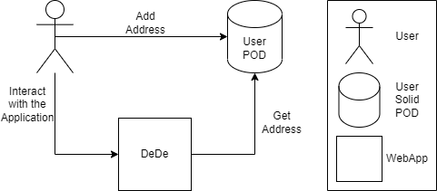

[[section-system-scope-and-context]]
== System Scope and Context

DeDe is an online shopping system where users choose the products they wish to purchase by adding one or more addresses to their User POD.
The system is integrated with SOLID, where users manage their PODs and their data is under their control.

The system will only store user's address, securing other type of personal data from being stored.

=== Business Context

[options="header",cols="1,2,3"]
|===
|Entity|Input|Output
|User|The user interact with the application using a computer or other device.|The user output can be different, depending on the user inputs.
|User POD|If a POD has not yet been created, it is created and the user adds their address.|The POD sends the required information to the application.
|Web App|It receives the requests of the user and process it.|After process the requests and get the information, it is shown to the user.
|===

=== Technical Context
The system uses a SOLID architecture, respecting user privacy, making personal information decentralized.
For this we use user PODS, making users control their own information
[options="header",cols="1,2"]
|===
|Technology|Description
|MongoDB|Used as database of the WebApp.
|React|Library to ease the programming of the application.
|TypeScript|Used to program.
|===
