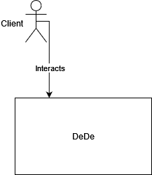
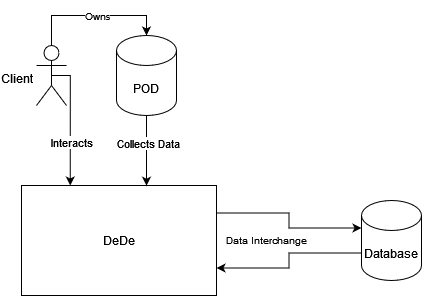

[[section-building-block-view]]

== Building Block View

[role="arc42help"]
The building block view shows the static decomposition of the system into building blocks as well as their dependencies. It allows us to understand the system as a whole.

////
  *Level 1* is the white box description of the overall system together with black
  box descriptions of all contained building blocks.
  *Level 2* zooms into some building blocks of level 1.
  Thus it contains the white box description of selected building blocks of level 1, together with black box descriptions of their internal building blocks.
  *Level 3* zooms into selected building blocks of level 2, and so on.
////

=== Whitebox Overall System
[role="arc42help"]
****

////
  Here you describe the decomposition of the overall system using the following white box template. It contains

  * an overview diagram
  * a motivation for the decomposition
  * black box descriptions of the contained building blocks. For these we offer you alternatives:

    ** use _one_ table for a short and pragmatic overview of all contained building blocks and their interfaces
    ** use a list of black box descriptions of the building blocks according to the black box template (see below).
    Depending on your choice of tool this list could be sub-chapters (in text files), sub-pages (in a Wiki) or nested elements (in a modeling tool).

  * (optional:) important interfaces, that are not explained in the black box templates of a building block, but are very important for understanding the white box.
  Since there are so many ways to specify interfaces why do not provide a specific template for them.
  In the worst case you have to specify and describe syntax, semantics, protocols, error handling,
  restrictions, versions, qualities, necessary compatibilities and many things more.
  In the best case you will get away with examples or simple signatures.
////

Motivation::

The Whitebox Overall System diagram is a simple diagram to help understand the system by seeing the big picture. As the site is a shopping site, the ineraction is simple.

Contained Building Blocks::
 * DeDe: The name of our site. Decentralized Delivery 
 * Client: The potential client of our site.
****

[role="arc42help"]
=== Level 1
****

[cols="1,3" options="header"]
|===
| **Name**  | **Responsibility**
| POD       |  Stores the data of the client
| Database  |  Stores our own data
| Client    |  Our major stakeholder, uses our site
|===

****

////
  === Level 2

  [role="arc42help"]
  ****
  Here you can specify the inner structure of (some) building blocks from level 1 as white boxes.

  You have to decide which building blocks of your system are important enough to justify such a detailed description.
  Please prefer relevance over completeness. Specify important, surprising, risky, complex or volatile building blocks.
  Leave out normal, simple, boring or standardized parts of your system
  ****

  ==== White Box _<building block 1>_

  [role="arc42help"]
  ****
  ...describes the internal structure of _building block 1_.
  ****

  _<white box template>_

  ==== White Box _<building block 2>_

  _<white box template>_

  ...

  ==== White Box _<building block m>_

  _<white box template>_

  === Level 3

  [role="arc42help"]
  ****
  Here you can specify the inner structure of (some) building blocks from level 2 as white boxes.

  When you need more detailed levels of your architecture please copy this
  part of arc42 for additional levels.
  ****

  ==== White Box <_building block x.1_>

  [role="arc42help"]
  ****
  Specifies the internal structure of _building block x.1_.
  ****

  _<white box template>_

  ==== White Box <_building block x.2_>

  _<white box template>_

  ==== White Box <_building block y.1_>

  _<white box template>_
////