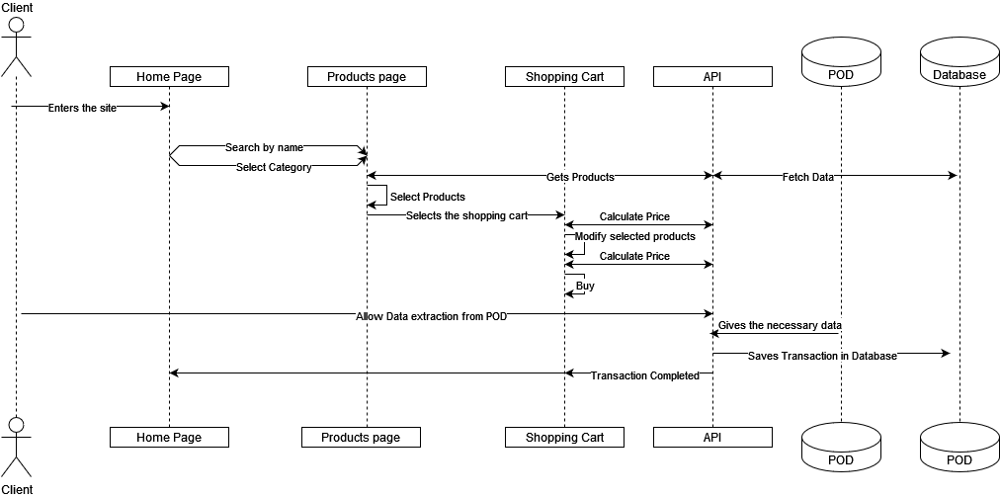

[[section-runtime-view]]
== Runtime View

[role="arc42help"]
////
.Contents
The runtime view describes concrete behavior and interactions of the system’s building blocks in form of scenarios from the following areas:

* important use cases or features: how do building blocks execute them?
* interactions at critical external interfaces: how do building blocks cooperate with users and neighboring systems?
* operation and administration: launch, start-up, stop
* error and exception scenarios

Remark: The main criterion for the choice of possible scenarios (sequences, workflows) is their *architectural relevance*. It is *not* important to describe a large number of scenarios. You should rather document a representative selection.

.Motivation
You should understand how (instances of) building blocks of your system perform their job and communicate at runtime.
You will mainly capture scenarios in your documentation to communicate your architecture to stakeholders that are less willing or able to read and understand the static models (building block view, deployment view).

.Form
There are many notations for describing scenarios, e.g.

* numbered list of steps (in natural language)
* activity diagrams or flow charts
* sequence diagrams
* BPMN or EPCs (event process chains)
* state machines
* ...

////

=== Log In

////
 * _<insert description of the notable aspects of the interactions between the
building block instances depicted in this diagram.>_
////
The the runtime interactions inside the system to log or register are the following:

 - First the client enters the webpage.
 - Then clicks on login/register, it goes to the log in page.
 - The user is required to allow the the app to collect data from the POD.
 - If allowed, the POD gives the necessary data.
 - We look into our database to see if user exists, if exists brings back his data, if dont we store them.
 - Now the user is logged in and it goes back to the home page.

////
It is possible to use a sequence diagram:

image:
[plantuml,"Sequence diagram",png]
----
actor Alice
actor Bob
database Pod as "Bob's Pod"
Alice -> Bob: Authentication Request
Bob --> Alice: Authentication Response
Alice  --> Pod: Store route
Alice -> Bob: Another authentication Request
Alice <-- Bob: another authentication Response
----
////
=== Purchase 

The the runtime interactions inside the system purchase any item in our store are the following:

 - First the client enters the webpage.
 - Then searches the product they want by their name or searching by category.
 - After that, the API is called and it fetches the products the user searched from the database.
 - Afterwards the user will select the items he wants to buy.
 - We look into our database to see if user exists, if exists brings back his data, if dont we store them, and after finishing, they will go to the shopping cart to conclude.
 - The api will calculate the price, and if the user modifies the products, it will calculate it again.
 - Then the user will press buy.
 - For the order to be sent, the user is required to allow the app to collect data from the POD, in this case, his credit card, adress and other relevant data. After allowed, the API stores into the database the order.
 - And finally the user is sent back to the home page.

////
=== ...

=== <Runtime Scenario n>
////