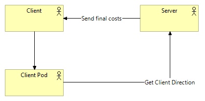

[[section-concepts]]
== Cross-cutting Concepts

=== Domain model

The address of the clients will be stored in their pods, being requested by the server to calculate the shipping costs. Once this process is done, the server will send the customer the final costs of their purchase.

=== Security and Safety

The app will provide users with a safe and secure environment. To carry this out the application will be developed using technologies such as SOLID taking into account its recommendations for use on issues related to data storage using pods. Another aspect is the use of protocols with the HTPPS for the connection with our application.

=== Usability
One of the important aspects of our application is that it can be used easily by any type of user. For this, it will be sought that the application has the least number of technical requirements in its use.

=== Accessibility
The color palette used in the application will be chosen taking into account that it is accessible to people with some type of color blindness.
